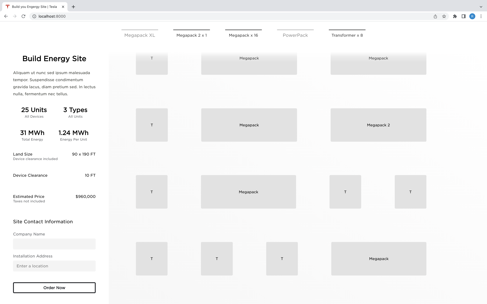
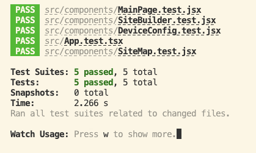

# Tesla Energy Service Engineering Frontend Engineer Evaluation

> Rui Xiao xrui0310@gmail.com


### What It Looks Like





### Online Demo

https://elon-musk-wants-to-hire-me.surge.sh/

### Github Repository

https://github.com/EatTooMuchEveryDay/Elon-Musk-Wants-To-Hire-Me

### How to Run

Get into the root directory of project, then execute the following command:

```shell
npm install && npm start
```

Then you will see the output saying it running on port 8000. Open your browser (Google Chrome is recommended) and check how it looks like at http://localhost:8000/.

### How to Execute Test

Get into the root directory of project, then execute the following command:

```shell
npm test
```

Test output should be similar to following:

```shell
 PASS  src/components/MainPage.test.jsx
 PASS  src/components/SiteMap.test.jsx
 PASS  src/components/DeviceConfig.test.jsx
 PASS  src/App.test.tsx
 PASS  src/components/SiteBuilder.test.jsx

Test Suites: 5 passed, 5 total
Tests:       5 passed, 5 total
Snapshots:   0 total
Time:        3.139 s
Ran all test suites related to changed files.
```



### Assumptions

1. 10 FT clearance between devices are needed, even this could reduce possible arrangements with the site width restriction of 100 FT. And the clearance is also included in the $Land\ Size$ section.
2. Autogenerated battery arrangement should balance between minimizing land size and distributing transformer evenly. So there is no best way to arrange them. I randomly mixed different device types and minimized the land size based on that.